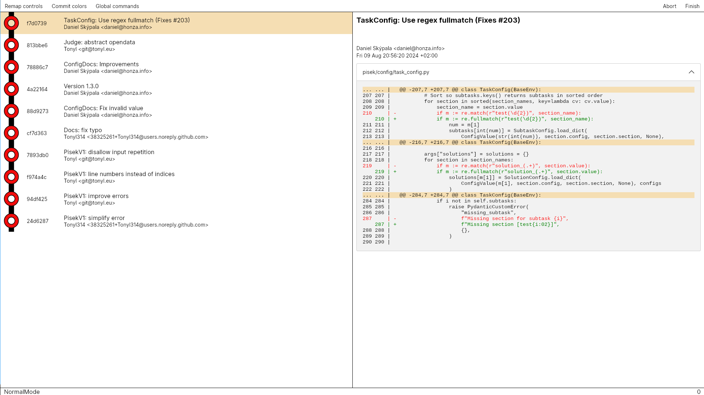

# ChronoGit

Visual [sequence editor](https://git-scm.com/docs/git-config#Documentation/git-config.txt-sequenceeditor) for interactive rebasing.



## Table of Contents

* [Instalation](#Instalation)
* [Setup](#Setup)
* [Usage](#Usage)
* [Controls](#Controls)

## Installation

Head out to the releases tab ➡️ and grab an executable that suits your system.

## Setup

```
git config --global sequence.editor ChronoGit
```

For changing it only for one rebase:
```
GIT_SEQUENCE_EDITOR="ChronoGit" git rebase -i <label>
```

## Usage

### Modes

ChronoGit takes heavy inspiration from vim keybindings.
There are 3 modes:
- Normal mode - Moving and editing single command
- Visual mode - Moving and editing blocks of commands
- Insert mode - Editing command arguments (*label*, *merge*, *reset* & *exec*)

From Normal mode you can use `V` to switch to visual mode.
Use `I` from normal mode on *label*, *merge*, *reset* or *exec* to edit
it's argument. `Esc` in any mode to switch back to normal mode.

In normal mode, only current command is considered selected.
In visual, all between visual mode start and current are considered selected.

### Editing

Use `Up`, `Down`, `PageUp`, `PageDown`, `Home` and `End` to move around.

You can change all commit current selection to *pick*, *reword*, *edit*, *squash*,
*fixup*, *drop* by pressing the first letter.

`K` and `J` are used to move the current selection up and down respectively.

You can add *break*, *exec*, *label*, *reset* and *merge* after your selection.
Hold `Shift` to add them before your selection.

For Undo & Redo use `U` and `Ctrl+R`.  

Use **Abort** to discard current work. Use **Finish** to rebase.

### Commit details

Commit details window can be toggled with `Ctrl+C`.

### Coloring commits

You can change color of commits in the **Commit colors** window.
You can color commits:
- With the same color (`Ctrl+S`)
- By committer (`Ctrl+C`)
- By date (`Ctrl+D`)
- By regex (Commits with same regex group $i$ will be colored same.)

As there are not that many colors, they might need to be reused.

### Global commands

For adding *break* or *exec* command after each committing command
(*pick*, *reword* or *edit*), go to **Global commands**.
## Controls
**Tip:** You can always remap controls from the menu.

Default controls:

| Action                          | Shortcut   |
| ------------------------------- | ---------- |
| Toggle **c**ommit details       | `Ctrl+C`   |
| Enter normal mode               | `Esc`      |
| Toggle visual mode              | `V`        |
| Enter insert mode               | `I`        |
| Move up                         | `Up`       |
| Move down                       | `Down`     |
| Move page up                    | `PageUp`   |
| Move page down                  | `PageDown` |
| Move to top                     | `Home`     |
| Move to bottom                  | `End`      |
| Shift selection up              | `K`        |
| Shift selection down            | `J`        |
| Convert selection to **p**ick   | `P`        |
| Convert selection to **r**eword | `R`        |
| Convert selection to **e**dit   | `E`        |
| Convert selection to **s**quash | `S`        |
| Convert selection to **f**ixup  | `F`        |
| Convert selection to **d**rop   | `D`        |
| Add **b**reak after selection   | `B`        |
| Add **b**reak before selection  | `Shift+B`  |
| Add e**x**ec after selection    | `X`        |
| Add e**x**ec before selection   | `Shift+X`  |
| Add **l**abel after selection   | `L`        |
| Add **l**abel before selection  | `Shift+L`  |
| Add rese**t** after selection   | `T`        |
| Add rese**t** before selection  | `Shift+T`  |
| Add **m**erge after selection   | `M`        |
| Add **m**erge before selection  | `Shift+M`  |
| Delete selection                | `Delete`   |
| Undo                            | `U`        |
| Redo                            | `Ctrl+R`   |
| Color all commits **s**ame      | `Ctrl+S`   |
| Color commits by **a**uthor     | `Ctrl+A`   |
| Color commits by **d**ate       | `Ctrl+D`   |
